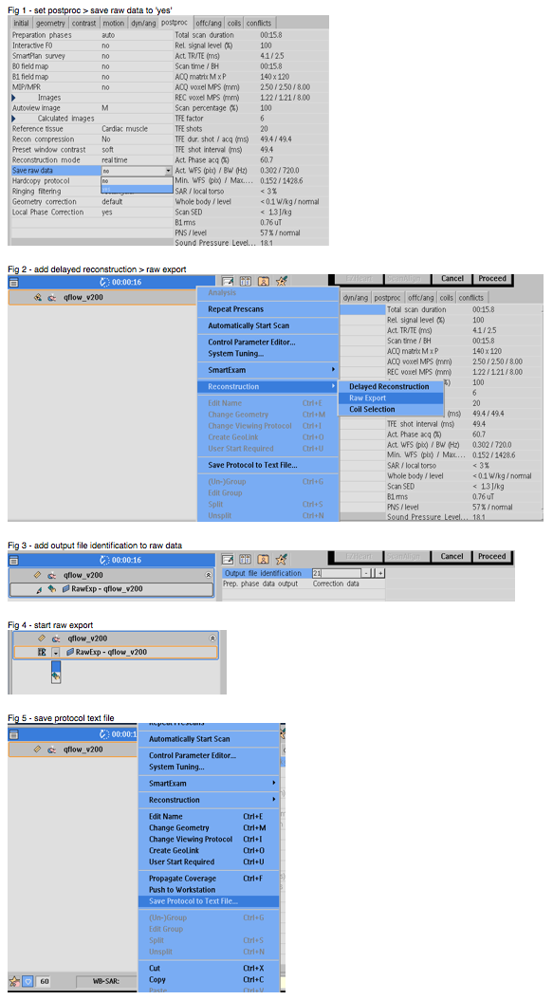

# MOG-Philips

[MOG-Philips](https://github.com/jfpva/MOG-Philips) is an extension of [MOG-Public](https://github.com/MetricOptimizedGating/MOG-Public)  
for metric-based gating of cardiac MRI performed on Philips scanners targeted to
fetal imaging.

## Method

Note: various [limitations](#limitations).

1. image acquisition
  * cardiac gated, oversampling expected heart rate
  * “Save raw data” = “yes” on Post/Proc tab
  * no long pauses (> R-R) between echoes
2. save raw .data/.list files
  * set postproc > save raw data to 'yes' (fig1)
  * add delayed reconstruction > raw export (fig2)
  * add output file identification to raw data, e.g., series number (fig3)
  * start raw export (fig4)
  * copy raw000.data and raw000.list from G:\Temp
3. save protocol .txt file
  * save protocol text file (fig5)
4. reconstruct using MOG in Matlab
  * navigate to directory containing MOG-Philips or add to Matlab path
  * run MOG_example

  

## Limitations

1. proposed method not yet generalised or tested for robustness
2. accommodation for variation between scanner software versions (i.e., R3, R4, R5) may need to be made
3. online, or at least comprehensive, image reconstruction after MOG processing still to be addressed

 

---  

---  

====
MOG is a MATLAB based image reconstruction pipeline for metric based gating in fetal cardiac MRI. It was developed at The Hospital for Sick Children in Toronto, Canada. It is licensed for non-commercial use. Two publications have been published on metric optimized gating. If you use MOG in a scientific paper please cite:  1) Jansz MS, Seed M, van Amerom JF, et al. Metric Optimized gating for fetal cardiac MRI. Magn Reson Med 2010;64(5):1304-1314.  2) Roy CW, Seed M, van Amerom JF, et al. Dynamic imaging of the fetal heart using metric optimized gating. Magn Reson Med 2013;70(6):1598-1607.

The Metric Optimization code found here initially uses two-parameter optimization as described in Jansz et al. and allows the option to refine the results with the multi-parameter model as described in Roy et al. The multi-parameter model is quite slow especially if the initial start point is far from the optimized heart rate.

For more information on MOG, visit: http://www.sickkids.ca/Research/fetalMRI/MOG/index.html

====

====
To run code:

    Add the MOG-Public directory to your MATLAB path
    Run MOG_Tool.m  
    You will be prompted to select a dataset and region of interest to optimize.
    Test datasets are provided in the folder Test Data

The dataset structure contains times for each measurement and echos transformed and cropped in the frequency encoding direction.

Structure:

    Data(Rows,Velocity Encodes).Times(Measured Cardiac Phases)
    Data(Rows,Velocity Encodes).KSpace(Columns, Coils, Measured Cardiac Phase)

Once two-parameter optimization is complete a plot of two heart rates applied to the two halves of the scan and entropy as a metric of reconstruction quality.  

To run the multi-parameter model select refine, once optimization is complete a plot of heart rates from the two-parameter and multi-parameter model is displayed.

===

If you are satisfied with the results select patched to save the results.

A version of MOG which inputs Siemens raw data header files (*.dat) and outputs optimized header files is available on the IDEA Forum (www.mr-idea.com). This version is the same as found on this repository with the exception of two files read_raw_data.m and write_raw_data.m. The Siemens version works for VB or VD data headers. GRAPPA reconstruction with raw data headers as output does not currently work but is in development.

====
Questions or comments? Contact us by creating a new issue on this page or directly:  Aneta Chmielewski: aneta.chmielewski@sickkids.ca Chris Roy: christopher.roy@sickkids.ca
